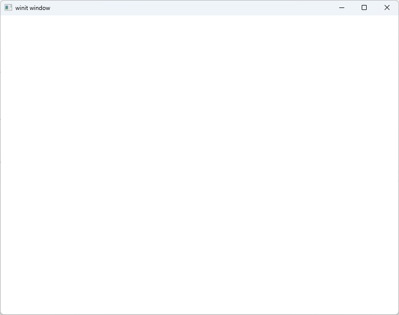
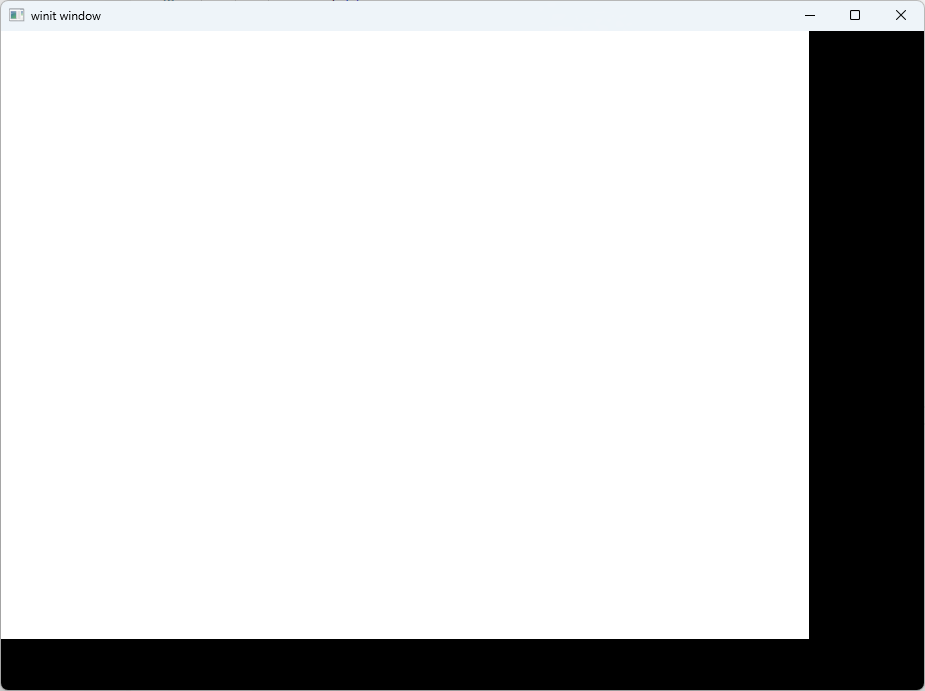

本章将基于`winit`创建window窗口。


首先，我们从winit的[文档示例](https://docs.rs/winit/latest/winit/)开始

winit需要创建一个`Eventloop`，构建桌面应用程序的事件循环，这也是我们的应用程序运行的关键。
下面的代码中，我们在主程序定义了一个`EventLoop`，设置了控制流
```rust
fn main() {

    let event_loop = EventLoop::new().unwrap();


    // ControlFlow::Poll continuously runs the event loop, even if the OS hasn't

    // dispatched any events. This is ideal for games and similar applications.

    event_loop.set_control_flow(ControlFlow::Poll);

    let mut app = App::default();

  

    event_loop.run_app(&mut app).unwrap();

}
```

> 如果你曾经有编写过Linux下的网络程序经验，一定对这样的代码并不陌生.....  


嗯，代码并不能运行，因为我们并没有定义App类型，先定义一个简单的App结构体，解决这个报错。
```rust
use std::num::NonZeroU32;
use winit::application::ApplicationHandler;
use winit::dpi::PhysicalSize;
use winit::event::WindowEvent;
use winit::event_loop::{ActiveEventLoop, ControlFlow, EventLoop};
use winit::window::{Window, WindowId};
#[derive(Default)]
struct App {
    window: Option<Window>,
}

impl ApplicationHandler for App {
    fn resumed(&mut self, event_loop: &ActiveEventLoop) {
        self.window = Some(
            event_loop
                .create_window(Window::default_attributes())
                .unwrap(),
        );
    }

    fn window_event(&mut self, event_loop: &ActiveEventLoop, id: WindowId, event: WindowEvent) {

        match event {
            WindowEvent::CloseRequested => {
                println!("The close button was pressed; stopping");
                event_loop.exit();
            }
            
            WindowEvent::RedrawRequested => {
                self.window.as_ref().unwrap().request_redraw();
            }
            _ => (),
        }
    }
}

fn main() {

    let event_loop = EventLoop::new().unwrap();


    // ControlFlow::Poll continuously runs the event loop, even if the OS hasn't

    // dispatched any events. This is ideal for games and similar applications.

    event_loop.set_control_flow(ControlFlow::Poll);

    let mut app = App::default();

  

    event_loop.run_app(&mut app).unwrap();

}
```

如果不出意外,你应该能够运行这个程序了。
  
嗯,什么也没有,和我们的代码一样....  
并且，如果你尝试对这个窗口尺寸进行修改,会出现更搞笑的一幕😅
  

原因是,我们的程序并没有对`WindowEvent::Resized`这个事件进行匹配,对修改完全开摆....  
不过,这不是我们目前的重点,先凑合用用