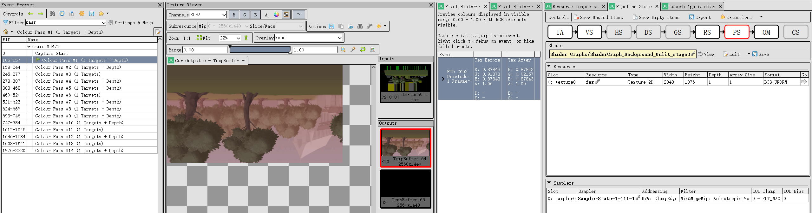
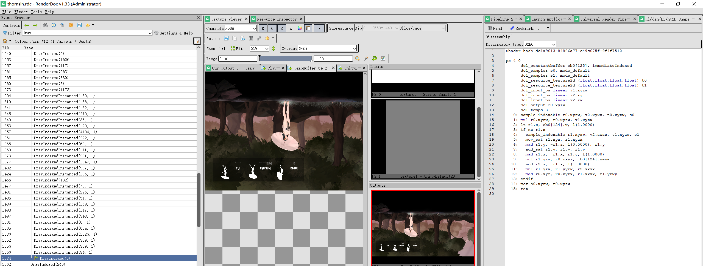
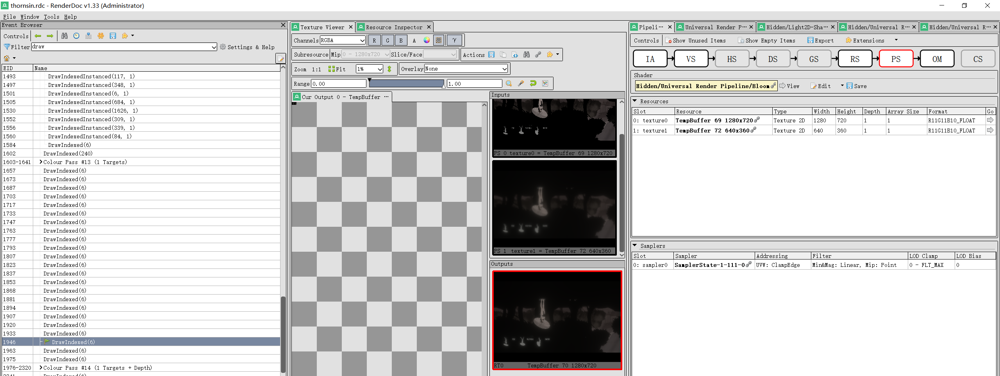
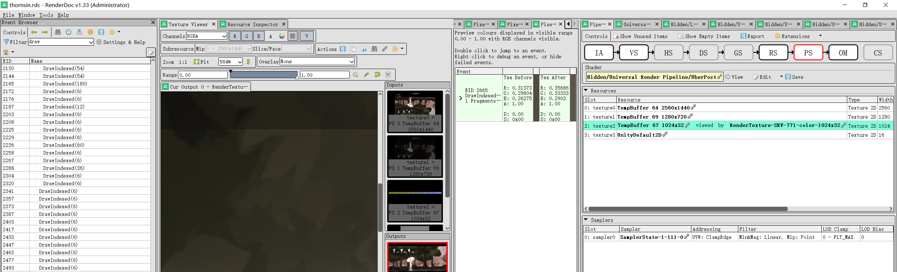

	下班回来想放纵时，突然发现某游戏的特效还挺华丽，作为TA练习生一下子就来了兴致，马上打开Renderdoc截帧分析下。

直接把Unity执行文件通过Renderdoc启动，即可将Renderdoc attach到进程上，然后直接F12截帧。

可以看到直接几个主要的render pass。

有些pass做了啥我并不清楚，挑几个典型的介绍

# 渲染背景
获取远景贴图渲染到RT
游戏对背景的渲染顺序是按照从远到近的顺序进行渲染

# 2D光照
2D光照选择使用了URP2D管线中的默认shader

# 人物渲染
游戏中的UI与人物在一个pass中一起渲染 

# Bloom
首先是经典的降采样，获得模糊的图像

再进行上采样获得原图二分之一尺寸大小的模糊图 

与原图混合，可以看到边缘像素颜色经过Bloom后被改变

攻击特效todo